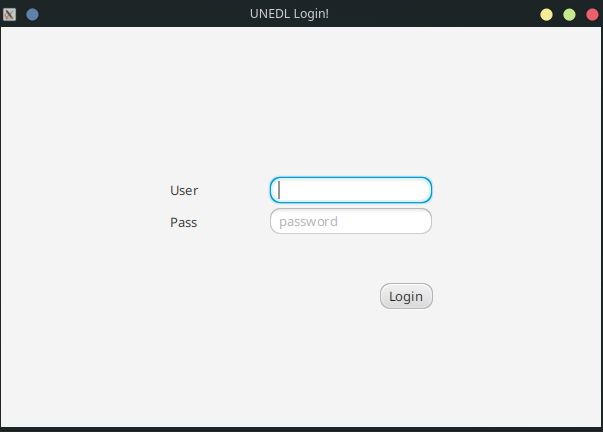

## Welcome to UNEDL Management System

This is not a collaborative project. The only purpose here is to show some of the functionalities of this software.

### LOG-IN

#### How to login?  
Here we should to enter a user and a password which are given by the manager.

### MANAGER

#### Hot to manage?  

##### Create
To create a new user we should to select the type at the botton left, then type the data and select the desired options, to finish just press create button.

##### Read
To read, at the top bar we should to select the "search by" options, type the data and then press search button.

##### Update
To update is very simple, we only should to double-click the cell (field) we want to change, once opened we type the new value and enter  
We can also press the active button to enable or disable a user

##### Delete
To delete we should to select the member we want to delete and then click delete button
